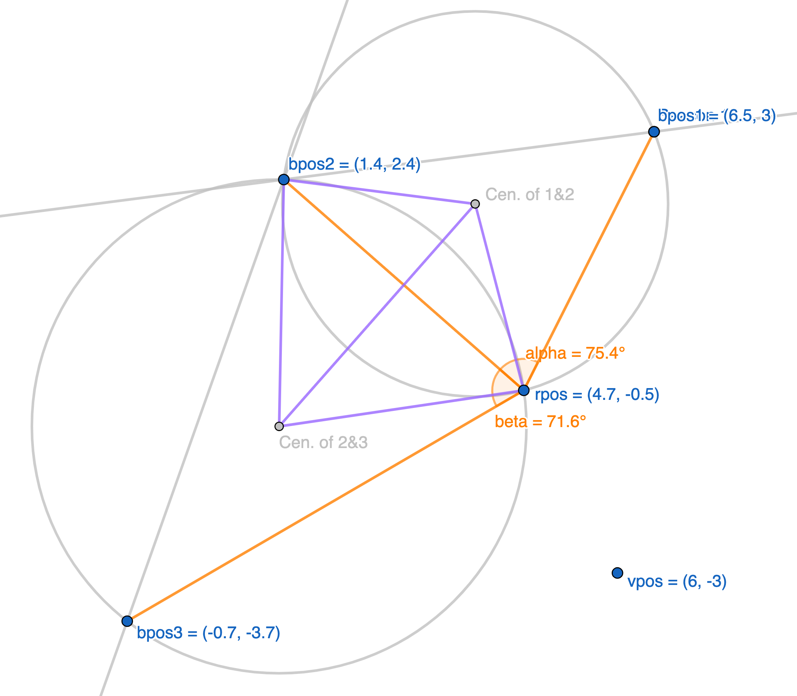
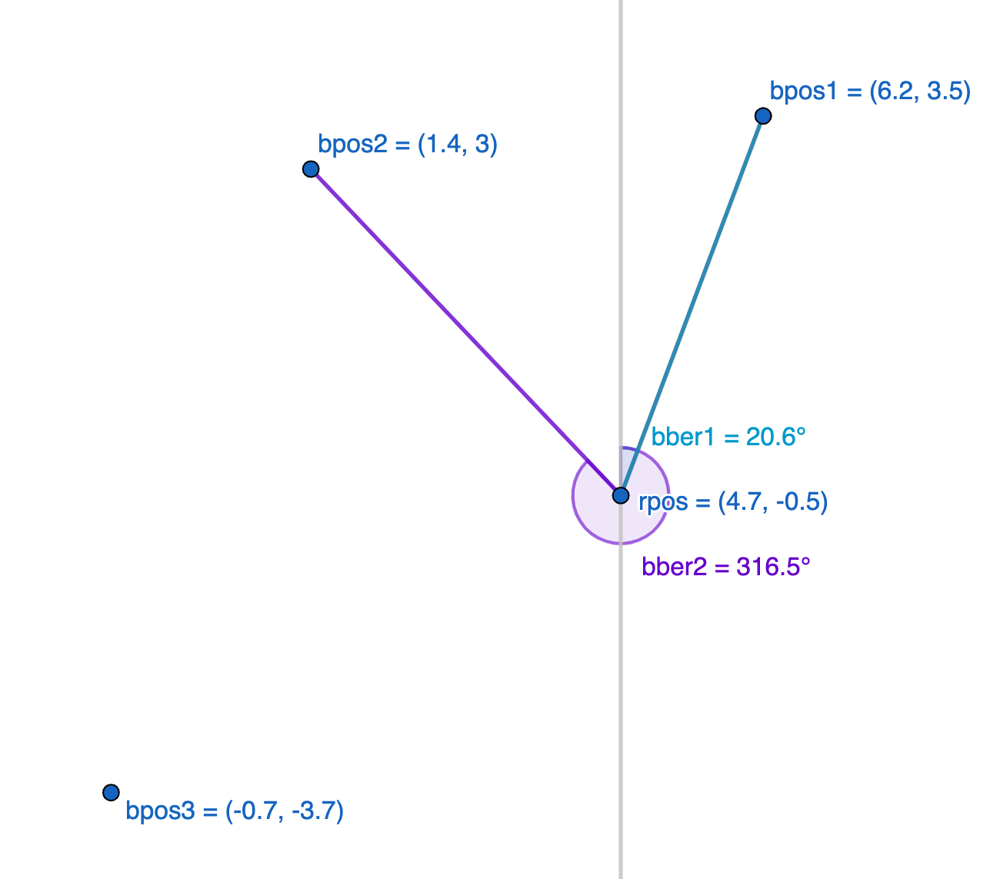

# map-triangulation

STATUS: `🟡 - PAUSED`

Javascript module that includes function to find position of a point on a map
using triangulation. Also includes useful vector and Cartesian plane operations.

## Usage

See [demo.mjs](./demo.mjs) for full usage. But basically you do the following:

1. Create points for beacons on a plane using `new Vector(yourX, yourY)`.
2. Create point for a random valid coordinate on plane specifying the valid quadrant.
3. Input variables into `findMyPosition3B2A` or `findMyPosition2B2B` function, which returns a Vector object,
4. Access position using the dot operator, e.g. `yourVec.x` or `yourVec.y`.

## Demo

Below is a snippet of [demo.mjs](./demo.mjs). See Figures 1 and 2 for validation in Geogebra ([docs/three-beacons.ggb](./docs/three-beacons.ggb) and [docs/two-beacons.ggb](./docs/two-beacons.ggb)).

```javascript
// find with 3 beacons and 2 angles...
let rpos1 = mt.findMyPosition3B2A(bpos1, bpos2, bpos3, alpha, beta, vpos);

// find with 2 beacons and 2 bearings...
let rpos2 = mt.findMyPosition2B2B(bpos1, bpos2, bber1, bber2);

// Locating with 3 beacons and 2 angles (using findMyPosition3B2A)...
// > rpos @ (4.7469943716757665, -0.46757721837406496)
// Locating with 2 beacons and 2 bearings (using findMyPosition2B2B)...
// > rpos @ (4.703556830980935, -0.4812225312238678)
```

|   |
| :-------------------------------: |
| Figure 1: Three Beacon Validation |

|   |
| :-------------------------------: |
| Figure 2: Two Beacon Validation   |

## File Structure

```text
root
├─ docs/
├─ core/
│  ├─ three.core.mjs
│  └─ two.core.mjs
├─ util/
│  └─ ...
├─ demo.mjs
├─ map-triangulation.mjs
└─ README.md
```

1. `docs/`: Directory contains readme support files.
2. `core/`: Core module of `findMyPosition3B2A` and `findMyPosition2B2B` functions.
3. `util/`: Utility functions, including `Vector` class and various Cartesian plane operations.
4. `map-triangulation.mjs`: Top-level module for importing into other applications.
